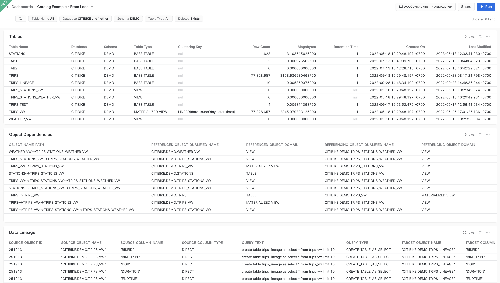
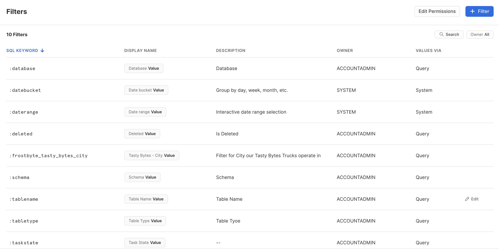
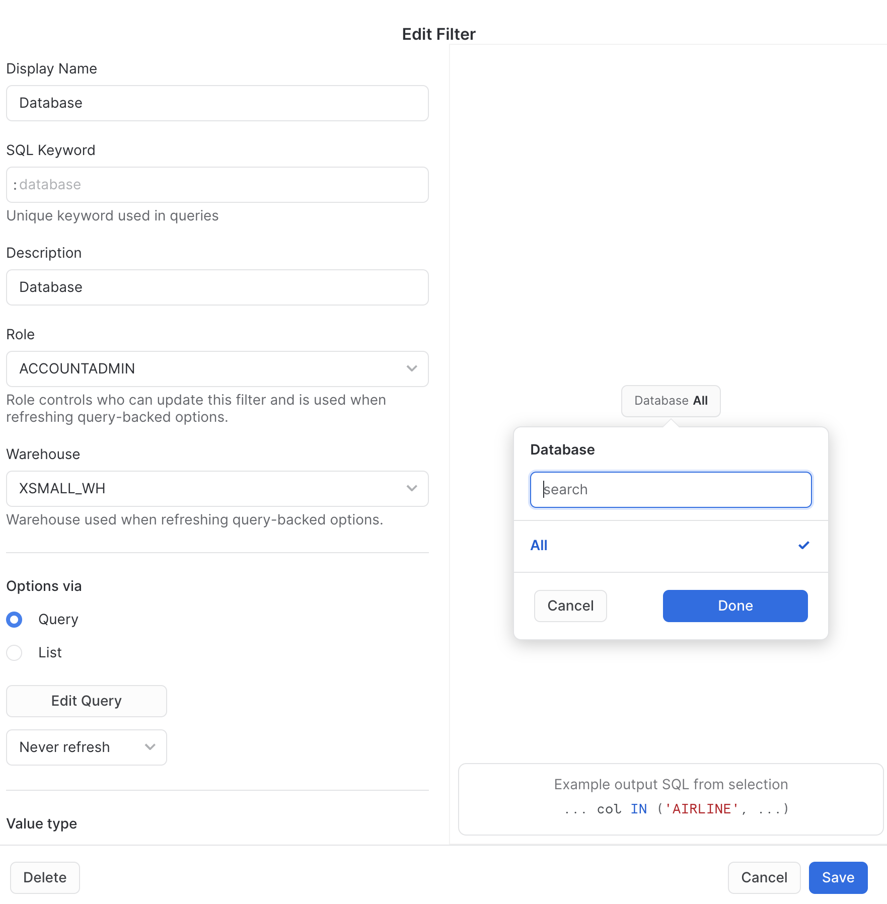
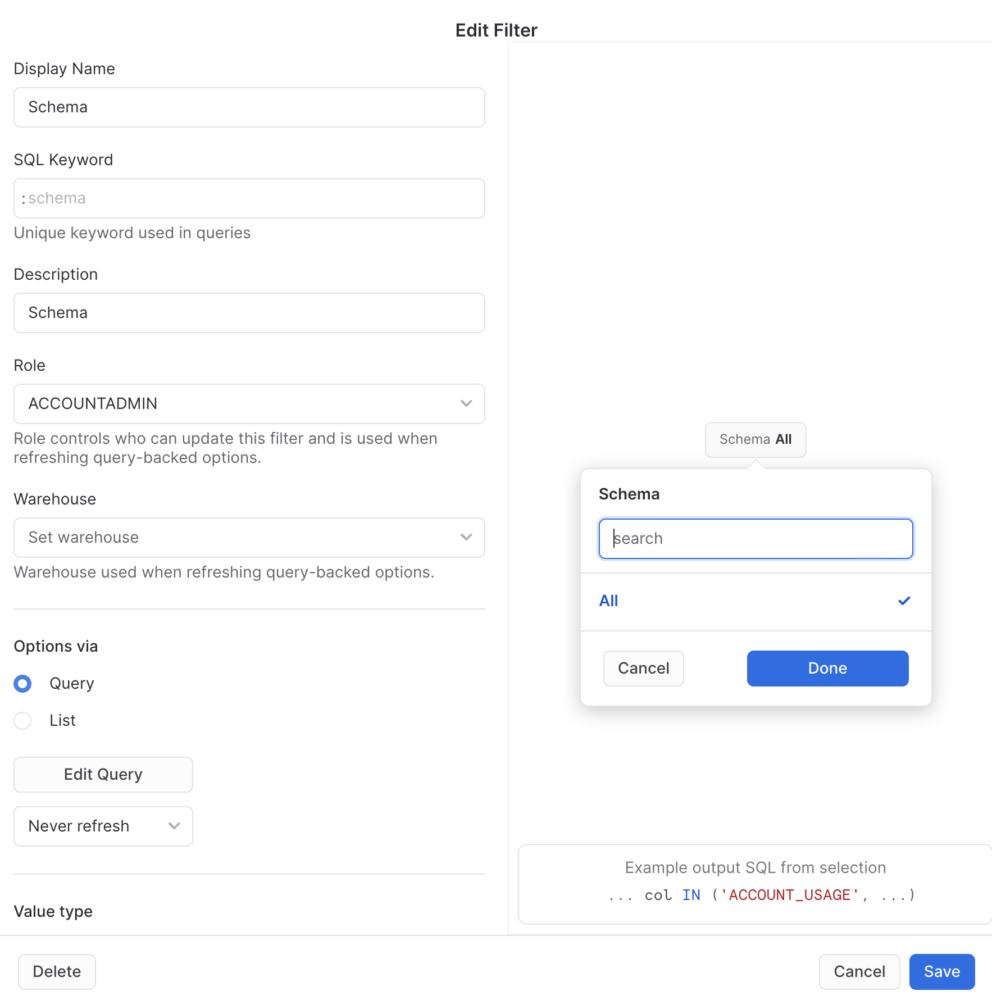

# Snowflake Native Data Catalog Dashboard

A Snowflake Snowsight Dashboard that displays Tables and Views, Object Lineage, and Data Lineage that can be filtered.  The Dashboard is text based.

The sample code assumes you are creating the Dashboard using the ACCOUNTADMIN role.  You should create the Dashboard using a custom role and grant the required privileges to access the source data, namely `snowflake.account_usage` views.



The dashboard is created using a combination of data from `snowflake.account_usage` views and locally copied data from the views to enhance performance.

The filters are based on snowflake.account_usage.tables.  You can refresh the filter values daily or hourly.

To build the dashboard, follow these steps:

1. Create the local tables based on snowflake.account_usage views.
2. Created the Dashboard Filters
3. Create the Dashboard Tiles

## 1 - Create Local Tables

Using local snapshots from `snowflake.account_usage` views can speed up the Dashboard and allow using a smaller size Warehouse but you will need to schedule a refresh of the snapshots.

Run [local_tables.sql](./local_tables.sql)

## 2 - Create the Dashboard Filters

List of filters in order, as configured on the Dashboard

- :tablename
- :database
- :schema
- :tabletype
- :deleted



&nbsp;

&nbsp;

---
#### :tablename


__Query:__
```
SELECT DISTINCT table_name
FROM snowflake.account_usage.tables
ORDER BY 1;
```
&nbsp;

&nbsp;

---
#### :database


__Query:__
```
SELECT DISTINCT table_catalog
FROM snowflake.account_usage.tables
ORDER BY 1 asc;
```
&nbsp;

&nbsp;

---
#### :schema


__Query:__
```
SELECT DISTINCT table_schema
FROM catalog.account_usage.tables
ORDER BY 1 asc;
```
&nbsp;

&nbsp;

---
#### :tabletype
