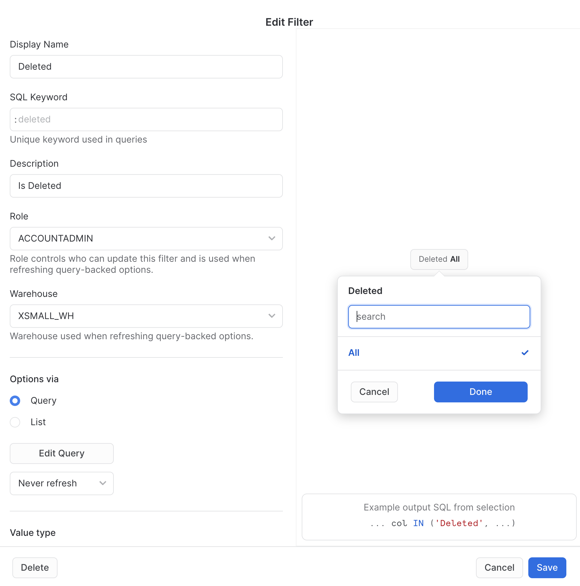

# Snowflake Native Data Catalog Dashboard

A Snowflake Snowsight Dashboard that displays Tables and Views, Object Lineage, and Data Lineage that can be filtered.  The Dashboard is text based.

The sample code assumes you are creating the Dashboard using the ACCOUNTADMIN role.  You should create the Dashboard using a custom role and grant the required privileges to access the source data, namely `snowflake.account_usage` views.


The dashboard is created using a combination of data from `snowflake.account_usage` views and locally copied data from the views to enhance performance.

The filters are based on snowflake.account_usage.tables.  You can refresh the filter values daily or hourly.

To build the dashboard, follow these steps:

1. Create the local tables based on snowflake.account_usage views.
2. Created the Dashboard Filters
3. Create the Dashboard Tiles

## 1 - Create Local Tables

Using local snapshots from `snowflake.account_usage` views can speed up the Dashboard and allow using a smaller size Warehouse but you will need to schedule a refresh of the snapshots.

Run [local_tables.sql](./local_tables.sql)

## 2 - Create the Dashboard Filters

List of filters in order, as configured on the Dashboard

- :tablename
- :database
- :schema
- :tabletype
- :deleted


&nbsp;

&nbsp;

---
#### :tablename


__Query:__
```
SELECT DISTINCT table_name
FROM snowflake.account_usage.tables
ORDER BY 1 ASC;
```
&nbsp;

&nbsp;

---
#### :database


__Query:__
```
SELECT DISTINCT table_catalog
FROM snowflake.account_usage.tables
ORDER BY 1 ASC;
```
&nbsp;

&nbsp;

---
#### :schema


__Query:__
```
SELECT DISTINCT table_schema
FROM snowflake.account_usage.tables
ORDER BY 1 ASC;
```
&nbsp;

&nbsp;

---
#### :tabletype


__Query:__
```
SELECT DISTINCT table_type
FROM snowflake.account_usage.tables
ORDER BY 1 ASC;
```
&nbsp;

&nbsp;

---
#### :deleted


__Query:__
```
SELECT DISTINCT CASE WHEN deleted IS NOT NULL THEN 'Exists' ELSE 'Deleted' END AS IsDeleted
FROM snowflake.account_usage.tables;
```
&nbsp;

&nbsp;


## 3 - Create Dashboard Tiles

### Tile 1

__Name:__ Tables

__Query:__
```
SELECT  table_name AS "Table Name"
       ,table_catalog AS "Database"
       ,table_schema AS "Schema"
       ,table_type AS "Table Type"
       ,clustering_key AS "Clustering Key"
       ,row_count AS "Row Count"
       ,bytes/1024/1024 AS "Megabytes"
       ,retention_time AS "Retention Time"
       ,created AS "Created On"
       ,last_altered AS "Last Modified"
       ,auto_clustering_on AS "Auto Clustering On"
       ,comment AS "Comment"
       ,CASE WHEN deleted IS NULL THEN 'Exists' ELSE 'Deleted' END AS "Is Deleted"
       ,deleted AS "Deleted Date"
FROM snowflake.account_usage.tables
WHERE true
  AND "Table Name" = :tablename
  AND "Database" = :database
  AND "Schema" = :schema
  AND "Table Type" = :tabletype
  AND "Is Deleted" = :deleted
ORDER BY 1 ASC;
```
